# System Architecture

## Overview

Gary-Asst is a calendar intelligence system that automatically generates personalized morning briefings for executives. It integrates with Microsoft Graph to fetch calendar events, enriches them with company and news data, and delivers digest emails.

## System Architecture Diagram

```mermaid
graph TB
    User[👤 User/Executive]
    WebUI[🌐 Web Interface<br/>Preview & Management]
    API[⚙️ Backend API<br/>FastAPI Application]
    Graph[📅 Microsoft Graph<br/>Calendar & Mail API]
    Pipeline[🔄 Processing Pipeline<br/>Enrichment & Generation]
    Email[📧 Email Delivery<br/>SendGrid/SMTP]

    User -->|Views Preview| WebUI
    User -->|Receives Email| Email
    WebUI -->|HTTP Requests| API
    API -->|OAuth2 Client Credentials| Graph
    Graph -->|Calendar Events| API
    API -->|Fetch & Process| Pipeline
    Pipeline -->|Enriched Data| API
    API -->|Send Digest| Email
    Email -->|Delivered| User

    style User fill:#e1f5ff
    style WebUI fill:#fff4e1
    style API fill:#e8f5e9
    style Graph fill:#f3e5f5
    style Pipeline fill:#fff9c4
    style Email fill:#ffebee
```



## Component Overview

### 1. Web Interface
- **Purpose**: Preview and manage digest generation
- **Technology**: HTML/JavaScript frontend (can be React/Vue/etc.)
- **Endpoints Used**:
  - `GET /digest/preview` - HTML preview
  - `GET /digest/preview.json` - JSON API
  - `GET /digest/search` - Search calendar events

### 2. Backend API
- **Framework**: FastAPI (Python)
- **Responsibilities**:
  - Route handling and request validation
  - Calendar provider abstraction
  - Context building and data orchestration
  - Response formatting

### 3. Microsoft Graph Integration
- **Authentication**: OAuth2 Client Credentials Flow
- **Endpoints Used**:
  - `/users/{user}/calendar/events` - Fetch calendar events
  - `/groups/{group}/members` - Get group members (for multi-user support)
- **Features**:
  - Date filtering (strict filtering by event start date)
  - Attendee filtering (only events where user is attendee/organizer)
  - Timezone handling (ET to UTC conversion)

### 4. Processing Pipeline
- **Components**:
  - **Calendar Provider**: Pluggable calendar abstraction (Mock/MS Graph)
  - **Enrichment Service**: Company and news data enrichment
  - **LLM Service**: Talking points and smart questions generation
  - **People Resolver**: Attendee identification and company matching
  - **Memory Service**: Past meeting context attachment
  - **Rendering**: HTML/plaintext digest generation

### 5. Email Delivery
- **Providers**: SendGrid, SMTP, Console (for testing)
- **Features**:
  - HTML and plaintext formats
  - Configurable recipients
  - Preview mode (no actual sending)

## Data Flow

```
1. User Request → Web Interface
   ↓
2. Web Interface → Backend API (GET /digest/preview?source=live&date=YYYY-MM-DD&mailbox=user@domain.com)
   ↓
3. Backend API → Calendar Provider → Microsoft Graph API
   ↓
4. Microsoft Graph → Calendar Events (filtered by date & attendee)
   ↓
5. Backend API → Processing Pipeline
   ├─→ Enrichment Service (company data, news)
   ├─→ People Resolver (attendee identification)
   ├─→ LLM Service (talking points, questions)
   └─→ Memory Service (past meeting context)
   ↓
6. Processing Pipeline → Rendering Service
   ↓
7. Backend API → Email Service
   ↓
8. Email Service → SendGrid/SMTP → User's Inbox
```

## Key Design Decisions

### 1. Pluggable Calendar Provider Pattern
**Decision**: Abstract calendar access behind a `CalendarProvider` protocol.

**Rationale**:
- Enables testing with mock data
- Allows switching between providers (Mock, MS Graph, Google Calendar, etc.)
- Simplifies unit testing

**Implementation**:
```python
class CalendarProvider(Protocol):
    def fetch_events(self, date: str, user: Optional[str] = None) -> List[Event]:
        ...
```

### 2. Strict Date and Attendee Filtering
**Decision**: Filter events at the API level, not just in the UI.

**Rationale**:
- Ensures data accuracy
- Prevents showing irrelevant events
- Reduces processing overhead

**Implementation**:
- Date filtering: Only events that start on the requested date
- Attendee filtering: Only events where the user is an attendee or organizer

### 3. Profile-Based Configuration
**Decision**: Use executive profiles to customize digest content.

**Rationale**:
- Supports multiple executives with different preferences
- Allows per-user customization (max items, sections order, company aliases)
- Enables mailbox-based profile lookup

### 4. Caching Strategy
**Decision**: TTL-based cache for preview data.

**Rationale**:
- Reduces API calls to Microsoft Graph
- Improves response times
- Configurable TTL per environment

### 5. Source Parameter Pattern
**Decision**: Use `source=live|sample` parameter throughout.

**Rationale**:
- Allows testing without live data
- Enables development with sample data
- Consistent pattern across all endpoints

## Security Considerations

1. **API Key Authentication**: Optional API key for protected endpoints
2. **OAuth2 Client Credentials**: Secure Microsoft Graph access
3. **Environment Variables**: Sensitive data stored in `.env` (not committed)
4. **Input Validation**: Date format validation, email validation
5. **Error Handling**: Graceful degradation (fallback to sample data on errors)

## Scalability Considerations

1. **Stateless API**: FastAPI is stateless, enabling horizontal scaling
2. **Caching**: Reduces load on Microsoft Graph API
3. **Async Operations**: FastAPI's async support for concurrent requests
4. **Provider Abstraction**: Easy to add new calendar providers

## Testing Strategy

1. **Unit Tests**: Test individual components (providers, services, renderers)
2. **Integration Tests**: Test API endpoints with mock data
3. **Provider Tests**: Test calendar provider implementations
4. **E2E Tests**: Test full flow with sample data

## Future Enhancements

1. **Database**: Store historical digests and meeting context
2. **Webhooks**: Real-time calendar event processing
3. **Multi-tenant**: Support for multiple organizations
4. **Analytics**: Track digest effectiveness and engagement
5. **Mobile App**: Native mobile interface
